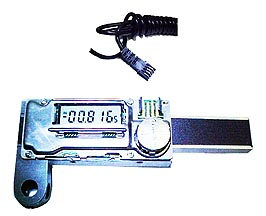

## Spoke Tensiometer

This sensor around which this project is based is the unusual "Digital Indicator with Data Output Port" sold by [B.G. Micro](http://www.bgmicro.com/digitalcaliperwithdataoutputport.aspx). I learnt a lot about how to hack this obscure tool in David Cook's Robot Room (http://www.robotroom.com/Digital-Indicator-3.html).

Because this linear measurement tool is based on a digital caliper, it has the same “24-bit” format as the data protocol for other oriental calipers. You can read about that here: http://www.robotroom.com/Caliper-Digital-Data-Port-2.html.

Much of the code in this Arduino sketch is about filtering the strange spikes in the generally noisy signal from the indicator.

The application is a hand-held tool to directly measure the tension of bicycle spokes. To be able to do that you obviously have to calibrated it against a spoke under controlled tension. The methodology for such a calibration is another story.

Anyway, this is what the finished tensiometer looks like.

The values are presented on a standard I2C driven 1602 LCD in this manner:

Link to the project description: https://sites.google.com/site/xnebmisc/home/tensiometer

